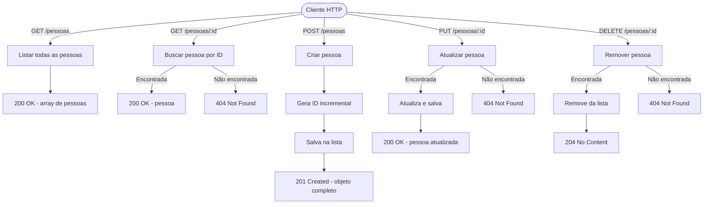
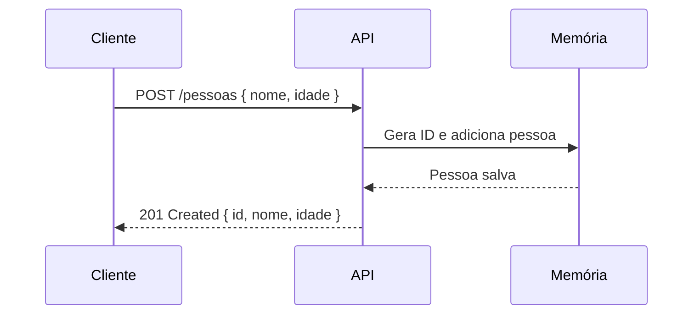

# CRUD de Pessoas — C# Minimal API

API REST simples para gerenciar pessoas, construída com ASP.NET Core Minimal API (.NET 8), sem bibliotecas externas.

---

## Prompt utilizado

> Crie um CRUD em C#. Esse CRUD é baseado no seguinte exemplo de arquivo JSON: `{"id":1,"nome":"Jacson","idade":34}`. Documente no README toda a API e adicione o prompt que utilizamos. Documente utilizando o diagrama de Mermaid. Não utilize bibliotecas externas. No post, retorne no response o objeto inteiro criado.

---

## Modelo de dados

```json
{
  "id": 1,
  "nome": "Jacson",
  "idade": 34
}
```

---

## Como executar

```bash
dotnet run
```

A API sobe em `http://localhost:5000`.

---

## Endpoints

### GET /pessoas
Retorna a lista de todas as pessoas.

**Response 200**
```json
[
  { "id": 1, "nome": "Jacson", "idade": 34 }
]
```

---

### GET /pessoas/{id}
Retorna uma pessoa pelo ID.

**Response 200**
```json
{ "id": 1, "nome": "Jacson", "idade": 34 }
```

**Response 404**
```json
{ "message": "Pessoa não encontrada." }
```

---

### POST /pessoas
Cria uma nova pessoa. Retorna o objeto completo criado, incluindo o `id` gerado.

**Request body**
```json
{ "nome": "Jacson", "idade": 34 }
```

**Response 201**
```json
{ "id": 1, "nome": "Jacson", "idade": 34 }
```

---

### PUT /pessoas/{id}
Atualiza os dados de uma pessoa existente.

**Request body**
```json
{ "nome": "Jacson Silva", "idade": 35 }
```

**Response 200**
```json
{ "id": 1, "nome": "Jacson Silva", "idade": 35 }
```

**Response 404**
```json
{ "message": "Pessoa não encontrada." }
```

---

### DELETE /pessoas/{id}
Remove uma pessoa pelo ID.

**Response 204** — sem corpo

**Response 404**
```json
{ "message": "Pessoa não encontrada." }
```

---

## Diagrama de fluxo da API



---

## Diagrama de sequência — POST /pessoas


